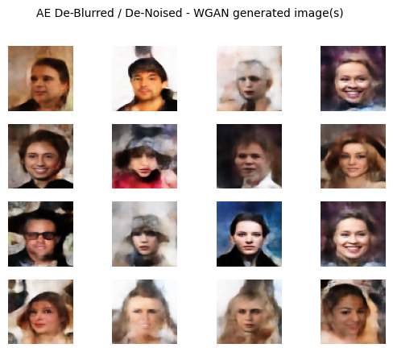

# Generating Images using a WGAN-AE stack - [Human Faces] 

This project contains an implementation (Keras) of the Wasserstein GAN (WGAN) for generating images. 
Additionally, it has an Autoencoder (AE) implementation (Keras) which is trained to perform de-noising & de-blurring on images. 

The models were trained seperately on the CelebA Dataset. However, these models can be used for any subject matter by simply changing the data in the "data" subdirectory of this project and following the steps in the Train_WGAN and Train_AE notebooks in this project's main folder. 

By stacking the AE on top of the WGAN, we can see a nice boost in the "realism" of the generated images. 

## WGAN-AE Performance

<p align="center" width="100%">
	
</p>

## Wasserstein GAN (WGAN) - Training Progress

<p align="center" width="100%">
	
</p>

## De-Noise/De-Blur Autoencoder (AE) - Training Progress

<p align="center" width="100%">
	
</p>

## AE Performance Boost

<p align="center" width="100%">
	
	
</p>

## installation
```bash
git clone https://github.com/thomasvandermars/wgan-ae
cd wgan-ae/
pip install -r requirements.txt
```

## Use pre-trained WGAN-AE model to generate faces

### Note! Re-combine decoder.keras model file using WinRAR
In order to upload the trained model (.keras file) for the AE decoder (see ./trained_models/AE/ folder), I had to split the file using WinRar (creating multiple part.rar files).
Re-combining the files (after downloading) using WinRar is fairly straightforward. This video does a good job explaining how: https://www.youtube.com/watch?v=hIshRXe2pYU. 

```bash
cd wgan-ae/
python generate.py --WGAN_name WGAN --AE_name AE --n 16 --title_fontsize 10 --fig_size 4
```

## The "data" subdirectory
This project has a "data" subdirectory which contains the dataset that the models can be trained on. 
Want to change what the WGAN and AE are trained on? Simply change the data in this folder and follow the steps in the Train_WGAN and Train_AE notebooks located in this project's main directory.

## Considerations

When considering how to further improve performance, the focus should be on:

- training the WGAN model longer (to convergence)
- increasing generator & discriminator architecture complexity (more layers, more filters, larger kernel sizes, etc.) 
- upping input resolution of the images
- introducing labels (conditional WGAN)

The perfomance boost (in general "realism") provided by the AE only works well when the images generated by the WGAN model have sufficient contrast (i.e. identifiable facial features). 